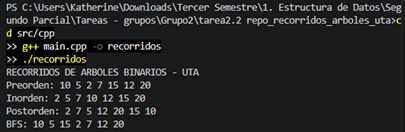
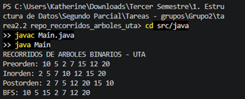
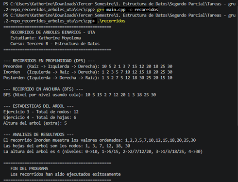
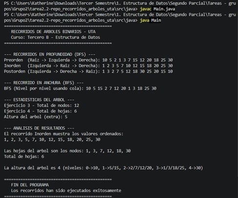

# Recorridos de Árboles Binarios - Estructura de Datos

**Universidad Técnica de Ambato**  
**Carrera:** Ingeniería de Software  
**Asignatura:** Estructura de Datos  
**Curso:** Tercero B  
**Tema:** Recorridos de árboles binarios: Inorden, Preorden, Postorden y BFS

## Objetivo general
Implementar y analizar los principales recorridos de árboles binarios utilizando C++ y Java, aplicando estructuras de datos dinámicas, recursividad y colas.

## Resultados de aprendizaje
Al finalizar la práctica, el estudiante será capaz de:

1. Explicar la diferencia entre recorridos DFS y BFS.
2. Implementar recorridos Inorden, Preorden y Postorden con recursividad.
3. Implementar BFS usando una cola.
4. Comparar la implementación en C++ y Java.
5. Aplicar recorridos de árboles a un caso real del proyecto final.

## Contenido

| Carpeta | Descripción |
|---|---|
| `docs/` | Guía práctica para la clase |
| `src/cpp/` | Implementación completa en C++ |
| `src/java/` | Implementación completa en Java |
| `exercises/` | Ejercicios para trabajo grupal |
| `moodle/` | Banco de preguntas tipo Moodle |
| `assets/` | Recursos de apoyo |

## Reglas de recorrido

| Recorrido | Orden |
|---|---|
| Inorden | Izquierda → Raíz → Derecha |
| Preorden | Raíz → Izquierda → Derecha |
| Postorden | Izquierda → Derecha → Raíz |
| BFS | Nivel por nivel usando cola |

## 📁 Estructura del Proyecto

```
tarea2.2-repo_recorridos_arboles_uta/
│
├── Capturas/
│   ├── Ejercicio1_C++.png
│   ├── Ejercicio1_Java.png
│   ├── Ejercicio2-3-4_C++.png
│   └── Ejercicio2-3-4_Java.png
│
├── docs/
│   └── guia_practica.md
│
├── src/
│   ├── cpp/
│   │   └── main.cpp → (integrado 5 nodos nuevos + resolución de los 5 ejercicios)
│   └── java/
│       └── Main.java → (integrado 5 nodos nuevos + resolución de los 5 ejercicios)
│
├── exercises/
│   └── ejercicios.md
│
├── moodle/
│   └── preguntas_moodle.md
│
└── README.md → (actualizado con la nueva información)
```

## 📸 Capturas de ejecución

### Ejercicio 1 - Árbol base (C++)


### Ejercicio 1 - Árbol base (Java)


### Ejercicio 2, 3 y 4 - Árbol ampliado (C++)


### Ejercicio 2, 3 y 4 - Árbol ampliado (Java)


## Ejecución en C++

```bash
cd src/cpp
g++ main.cpp -o recorridos
./recorridos
```

## Ejecución en Java

```bash
cd src/java
javac Main.java
java Main
```

## Actividad sugerida:

1. Clonar el repositorio.
2. Ejecutar el código base.
3. Agregar mínimo 5 nodos nuevos.
4. Mostrar los cuatro recorridos.
5. Modificar el caso de aplicación al proyecto final.
6. Subir evidencias al repositorio GitHub del grupo.

## Entregables

- Captura de ejecución en consola.
- Código fuente comentado.
- README del grupo.
- Explicación del caso real.
- Link del repositorio GitHub.

## Rúbrica breve sobre 10 puntos

| Criterio | Puntaje |
|---|---:|
| Implementación correcta de recorridos | 3 |
| Uso correcto de recursividad y cola | 2 |
| Código comentado y organizado | 1.5 |
| Aplicación al proyecto final | 2 |
| Uso de GitHub e IA documentada | 1.5 |

## 🔗 Repositorio GitHub

[https://github.com/kmoyolema3929/tarea2.2-repo_recorridos_arboles_uta.git](https://github.com/kmoyolema3929/tarea2.2-repo_recorridos_arboles_uta.git)
